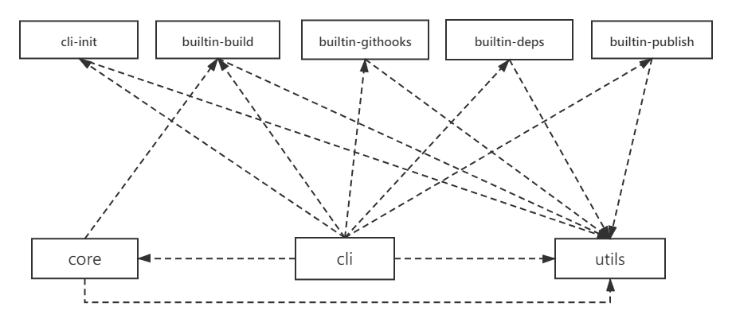

# Siu

> 取名`siu`,灵感来自`C罗`进球后的那声`siu...`

`@siujs/cli`是一个基于`Monorepo`+`Typescript`为主基调风格的插件化前端脚手架, 让类库开发亦或多项目开发场景的人员更轻松也更自由；

## 区别

`siu`不像`vue-cli`、`create-scripts`等其他比较成熟的`cli`工具去专项做某些事情;

- 优势

  - 简单：它只是一个集中地，他把控制权基本上都交给插件，由插件去发挥想象,自身只提供简单的辅助 api 和总的流程控制;
  - 强扩展性：完全可以将`vue-cli`、`create-scripts`包装成`siu`的插件来接入
  - 天然支持`Monorepo`

- 劣势

  - 适用的项目类型只有 `Monorepo `风格的

## 脚手架设计

|                                          模块                                          |                                                                  描述                                                                  |
| :------------------------------------------------------------------------------------: | :------------------------------------------------------------------------------------------------------------------------------------: |
|             [`core`](https://github.com/siujs/cli/tree/main/packages/core)             |                              整个脚手架的核心包，负责配置文件的解析、插件的定义、插件的装载、插件的执行等                              |
|            [`utils`](https://github.com/siujs/cli/tree/main/packages/utils)            |                                                        脚手架的辅助函数集合模块                                                        |
|    [`builtin-build`](https://github.com/siujs/cli/tree/main/packages/builtin-build)    |                                     内置基于`rollup`+`esbuild`+`@microsoft/api-extractor`的打包器                                      |
|     [`builtin-deps`](https://github.com/siujs/cli/tree/main/packages/builtin-deps)     |                              内置`dependencies\|devDependencies`的依赖安装/卸载处理（针对`monorepo`项目)                               |
| [`builtin-githooks`](https://github.com/siujs/cli/tree/main/packages/builtin-githooks) | 内置`git client hooks`的包装 ，主要配合`husky`； 支持`pre-commit`、`prepare-commit-msg`、`commit-msg`、`post-commit`、`post-merge` |
|  [`builtin-publish`](https://github.com/siujs/cli/tree/main/packages/builtin-publish)  |                                           内置模块发布包，支持`independent`模式以及制定特殊                                            |
|         [`cli-init`](https://github.com/siujs/cli/tree/main/packages/cli-init)         |                                                        专门执行项目初始化的模块                                                        |
|              [`cli`](https://github.com/siujs/cli/tree/main/packags/cli)               |                                                         对接 CLI 控制台的模块                                                          |

依赖关系如下图：

